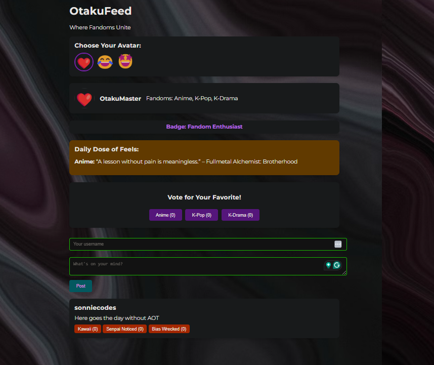

## Social Media Platform assignment
* Imagine you're assigned to develop a social media platform with React. 
* How would you break down the project into distinct components? 
* What components would you create for the user profile, new feed, comments and notifications sections

### My final product  is an app with the following features which are also my components 

1. User Avatar Selection - here you choose your favorite avatar from a list of options.
2. Profile we then diplay your username, avatar, and fandom interests (Anime, K-Pop, K-Drama).
3. You share posts with your followers and interact with other fans.
4. Ability to earn karma points based on your activity in the app.
5. Participate in fandom-related polls.
6. Get a daily anime, K-Pop, or K-Drama quote to inspire your day.

I have used React, Vite, css and JS

I was going for a different app with inspiration from discord